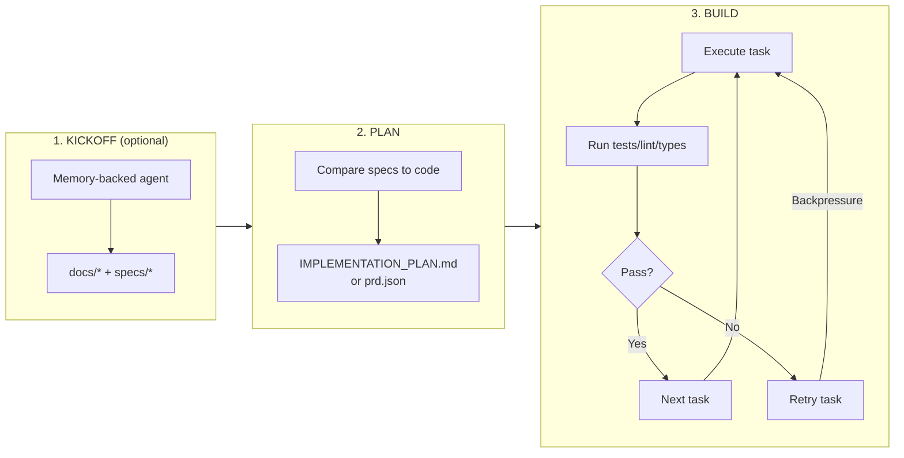

# Ralph Kit

Ralph Kit is a portable **implementation + augmentation** of the Ralph workflow, packaged so you can drop it into any repo.

In plain English, Ralph is a loop that:
1. **Kickoff** (optional): write clear docs/specs for a new project.
2. **Plan**: translate specs into a prioritized, test-aware task list.
3. **Build**: execute tasks with backpressure (tests/typecheck/lint), updating plan/status as you go.

Ralph Kit adds the scaffolding, prompts, and tooling to make that loop repeatable in real codebases.

- Playbook (background): https://github.com/ghuntley/how-to-ralph-wiggum
- This repo (do/ship): scripts + markdown templates you can apply to any codebase.
- Landing page: https://ralphkit.zakelfassi.com

## How the Workflow Works



**Backpressure** is the key concept: when tests fail, the agent retries the task instead of moving on. This keeps the codebase in a working state and prevents cascading failures.

## What it adds (augmentations)
- **Portable kit** vendorable as `ralph/` into any repo
- **Multi-model routing** (Codex for plan/review/security; Claude for build) + optional failover
- **Shared libraries** (`lib/core.sh`, `lib/llm.sh`) with rate-limiting, logging, notifications, and model failover
- **Two workflow lanes**: Checklist (IMPLEMENTATION_PLAN.md) or Tasks (prd.json with passes flags)
- **`plan-work` mode** for branch-scoped planning (avoids unreliable "filter tasks at runtime")
- **Safer defaults**: `RALPH_AUTOPUSH=false` by default
- **Runtime isolation**: logs/state in `.ralph/` (auto gitignored by installer)
- **Greenfield kickoff** helper to generate docs/specs via a memory-backed agent
- **Report ingestion** (`ingest-report.sh`) to convert analysis reports into requests
- **Optional Slack loop**: `ask.sh` + `QUESTIONS.md`, `notify.sh`
- **Optional daemon** with `[PAUSE]`, `[REPLAN]`, `[DEPLOY]` triggers in `REQUESTS.md`
- **Optional structured review/security gate** via JSON schemas
- **Installable skills** for Claude/Codex/Amp agents (prd, tasks)

## Quickstart (new or existing repo)

Install the kit:
```bash
./install.sh /path/to/target-repo --wrapper --skills
```

Then run a loop in the target repo:
```bash
cd /path/to/target-repo
./ralph.sh plan 1
./ralph.sh build 10
```

Or use the tasks lane with `prd.json`:
```bash
./ralph.sh tasks 10
```

If you're starting from scratch, run a kickoff to generate docs/specs first (see below).

## Install into another repo

From this repo:
```bash
./install.sh /path/to/target-repo --wrapper
```

If the kit is already vendored in a target repo at `./ralph`:
```bash
./ralph/install.sh --wrapper
```

## Kickoff (greenfield)

For projects starting from scratch, generate a prompt you can paste into a memory-backed agent (ChatGPT Projects, Claude Projects, etc.) to create high-quality `docs/*` + `specs/*`:

```bash
cd /path/to/target-repo
./ralph.sh kickoff "<one paragraph project brief>"
```

- Guide: `docs/kickoff.md`

## Run (in the target repo)

**Checklist lane** (default):
```bash
./ralph.sh plan 1        # Plan first iteration
./ralph.sh build 10      # Build up to 10 iterations
```

**Tasks lane** (prd.json-based):
```bash
./ralph.sh tasks 10      # Execute prd.json tasks
```

**Daemon mode** (watches for changes):
```bash
./ralph.sh daemon 300    # Check every 5 minutes
```

**Ingest a report** (convert to requests):
```bash
./ralph.sh ingest --report /path/to/report.md --mode request
```

## Run safely (GCP VM / Docker)

If you’re using auto-permissions (`--dangerously-skip-permissions`, `--full-auto`), run in an isolated environment.

- Full guide + pricing notes: `docs/sandboxing.md`
- One-command GCP VM provisioner: `ops/gcp/provision.sh`

## Workflow Lanes

Ralph Kit supports two approaches to task tracking:

### Checklist Lane (default)
Uses `IMPLEMENTATION_PLAN.md` with markdown checkboxes. Best for human-in-the-loop workflows where you want to review and modify the plan.

```bash
./ralph.sh plan 1    # Generate plan
./ralph.sh build 10  # Execute tasks
```

### Tasks Lane (optional)
Uses `prd.json` with machine-readable `passes: true/false` flags. Best for full automation with structured task definitions.

```bash
./ralph.sh tasks 10  # Execute prd.json tasks
```

**Comparison:**
| Aspect | Checklist Lane | Tasks Lane |
|--------|---------------|------------|
| Task file | `IMPLEMENTATION_PLAN.md` | `prd.json` |
| Progress tracking | Markdown checkboxes | `passes: true/false` |
| Run command | `./ralph.sh build N` | `./ralph.sh tasks N` |
| Best for | Human review/edits | Full automation |
| Status tracking | `STATUS.md` | `progress.txt` |

## Shared Libraries

The kit includes reusable bash libraries under `lib/`:

### lib/core.sh
- `ralph_core__log()` — Timestamped logging with levels (info, warn, error)
- `ralph_core__notify()` — Slack webhook notifications (requires `SLACK_WEBHOOK_URL`)
- `ralph_core__git_push_branch()` — Safe branch pushing with conflict handling
- `ralph_core__consume_flag()` — Read and clear control flags from `REQUESTS.md`
- `ralph_core__hash_content()` — Content hashing for idempotency checks

### lib/llm.sh
- `ralph_llm__run()` — Unified LLM execution with automatic model failover
- Supports both `claude` and `codex` CLIs
- Rate-limiting with exponential backoff
- Structured output support via JSON schemas
- Optional Codex security/review gates

## Daemon Mode

The daemon watches for changes and runs loops automatically:

```bash
./ralph.sh daemon 300  # Check every 5 minutes
```

**What it monitors:**
- Git changes (new commits, branch updates)
- `REQUESTS.md` modifications
- Control flags in `REQUESTS.md`

**Control flags:**
- `[PAUSE]` — Stop the daemon loop until flag is removed
- `[REPLAN]` — Trigger a re-planning pass before continuing build
- `[DEPLOY]` — Run `RALPH_DEPLOY_CMD` after successful build

**Blocker detection:**
The daemon includes blocker detection to prevent infinite loops when the agent is stuck waiting for human input (e.g., unanswered questions in `QUESTIONS.md`).

## Config

Edit `ralph/config.sh` (in the target repo) to set:
- `RALPH_AUTOPUSH=true` if you want auto-push
- `RALPH_TEST_CMD` (optional) to run after review auto-fixes
- `RALPH_DEPLOY_CMD` (optional) used by the daemon on `[DEPLOY]`

## Notes
- Optional Slack integration uses `.env.local` with `SLACK_WEBHOOK_URL=...`.
