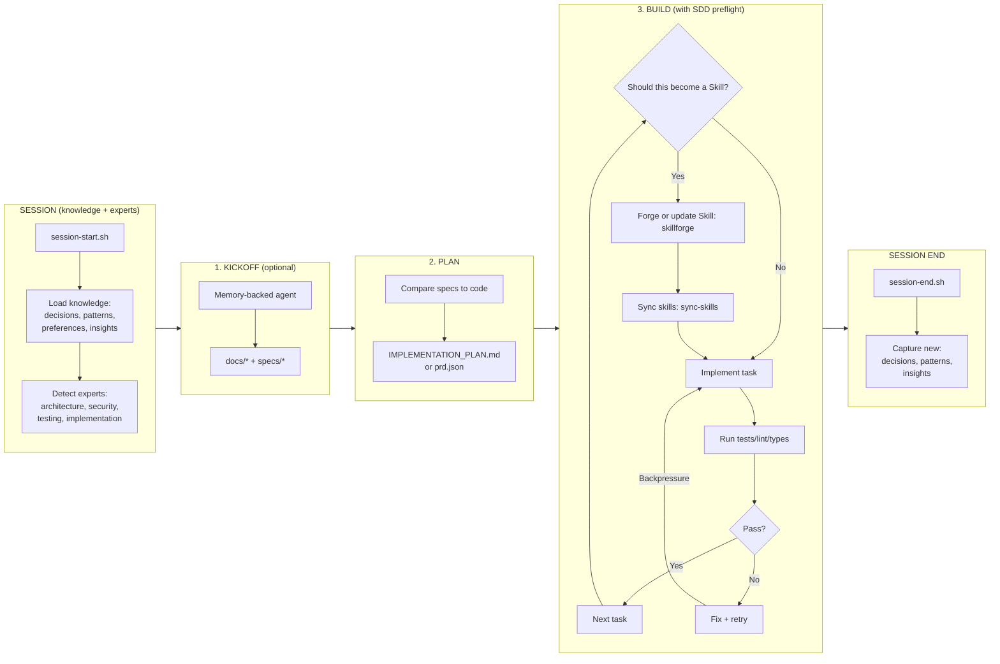

# Forgeloop

Forgeloop is a portable **agentic build loop** framework, packaged so you can drop it into any repo.

In plain English, Forgeloop is a loop that:
1. **Kickoff** (optional): write clear docs/specs for a new project.
2. **Plan**: translate specs into a prioritized, test-aware task list.
3. **Build**: execute tasks with backpressure (tests/typecheck/lint), updating plan/status as you go.

Forgeloop adds the scaffolding, prompts, and tooling to make that loop repeatable in real codebases — plus **Skills-Driven Development**: forge reusable agent Skills as you build, and grow a repo-specific “skill factory”.

**Inspiration & Sources:**
- [how-to-ralph-wiggum](https://github.com/ghuntley/how-to-ralph-wiggum) - The original Ralph methodology playbook by Geoff Huntley
- [marge-simpson](https://github.com/Soupernerd/marge-simpson) - Knowledge persistence & expert routing patterns (integrated in v2)
- [compound-product](https://github.com/snarktank/compound-product) - Product development patterns

**Links:**
- This repo: scripts + markdown templates you can apply to any codebase
- Landing page: https://forgeloop.zakelfassi.com

## How the Workflow Works



**Key concepts:**
- **Backpressure**: when tests fail, the agent retries the task instead of moving on. This keeps the codebase in a working state.
- **Knowledge persistence**: decisions, patterns, and insights persist across sessions via `system/knowledge/`.
- **Expert routing**: domain experts (architecture, security, testing, etc.) are loaded based on task keywords.

## What it adds (augmentations)
- **Portable kit** vendorable as `forgeloop/` into any repo
- **Multi-model routing** (Codex for plan/review/security; Claude for build) + optional failover
- **Shared libraries** (`lib/core.sh`, `lib/llm.sh`) with rate-limiting, logging, notifications, and model failover
- **Two workflow lanes**: Checklist (IMPLEMENTATION_PLAN.md) or Tasks (prd.json with passes flags)
- **`plan-work` mode** for branch-scoped planning (avoids unreliable "filter tasks at runtime")
- **Safer defaults**: `FORGELOOP_AUTOPUSH=false` by default
- **Runtime isolation**: logs/state in `.forgeloop/` (auto gitignored by installer)
- **Greenfield kickoff** helper to generate docs/specs via a memory-backed agent
- **Report ingestion** (`ingest-report.sh`) to convert analysis reports into requests
- **Log ingestion** (`ingest-logs.sh`) to turn runtime errors/logs into actionable requests (optional daemon trigger: `[INGEST_LOGS]`)
- **Optional Slack loop**: `ask.sh` + `QUESTIONS.md`, `notify.sh`
- **Optional daemon** with `[PAUSE]`, `[REPLAN]`, `[DEPLOY]`, `[INGEST_LOGS]`, `[KNOWLEDGE_SYNC]` triggers in `REQUESTS.md`
- **Optional structured review/security gate** via JSON schemas
- **Skills-Driven Development** primitives: `skillforge` + `sync-skills` + a typed skills library (`operational/`, `meta/`, `composed/`)
- **Knowledge persistence** (from marge-simpson): session-to-session memory via `system/knowledge/` (decisions, patterns, preferences, insights)
- **Domain expert system** (from marge-simpson): specialized guidance via `system/experts/` (architecture, security, testing, devops)
- **Lite mode**: `--lite` flag for one-shot simple tasks (uses `AGENTS-lite.md`)
- **Session hooks**: `session-start.sh` / `session-end.sh` for loading and capturing knowledge

## Quickstart (new or existing repo)

Install the kit:
```bash
./install.sh /path/to/target-repo --wrapper --skills
```

Then run a loop in the target repo:
```bash
cd /path/to/target-repo
./forgeloop.sh sync-skills      # refresh repo-scoped skill mirrors (.claude/skills; .codex/skills when writable)
./forgeloop.sh plan 1
./forgeloop.sh build 10
```

**Note:** `sync-skills` warns if a destination exists and is not a symlink (e.g., your custom skill directory). Use `--force-symlinks` to overwrite.

Or use the tasks lane with `prd.json`:
```bash
./forgeloop.sh tasks 10
```

If you're starting from scratch, run a kickoff to generate docs/specs first (see below).

## Install into another repo

From this repo:
```bash
./install.sh /path/to/target-repo --wrapper
```

If the kit is already vendored in a target repo at `./forgeloop`:
```bash
./forgeloop/install.sh --wrapper
```

### Conflict Handling

When files already exist, the installer offers several options:

| Flag | Behavior |
|------|----------|
| (default in TTY) | Interactive prompt: skip, overwrite, merge, or diff |
| `--batch` / `-b` | Silently skip existing files (CI-safe) |
| `--interactive` / `-i` | Force interactive prompts even in non-TTY |
| `--force` | Overwrite all existing files |

**Interactive options:**
- **skip** — Keep existing file (default)
- **overwrite** — Replace with template
- **merge** — Append template below a separator
- **diff** — Show differences, then ask again

## Kickoff (greenfield)

For projects starting from scratch, generate a prompt you can paste into a memory-backed agent (ChatGPT Projects, Claude Projects, etc.) to create high-quality `docs/*` + `specs/*`:

```bash
cd /path/to/target-repo
./forgeloop.sh kickoff "<one paragraph project brief>"
```

- Guide: `docs/kickoff.md`

## Run (in the target repo)

**Checklist lane** (default):
```bash
./forgeloop.sh plan 1        # Plan first iteration
./forgeloop.sh build 10      # Build up to 10 iterations
```

**Tasks lane** (prd.json-based):
```bash
./forgeloop.sh tasks 10      # Execute prd.json tasks
```

**Daemon mode** (watches for changes):
```bash
./forgeloop.sh daemon 300    # Check every 5 minutes
```

**Ingest a report** (convert to requests):
```bash
./forgeloop.sh ingest --report /path/to/report.md --mode request
```

## Run safely (GCP VM / Docker)

If you’re using auto-permissions (`--dangerously-skip-permissions`, `--full-auto`), run in an isolated environment.

- Full guide + pricing notes: `docs/sandboxing.md`
- One-command GCP VM provisioner: `ops/gcp/provision.sh`

## Workflow Lanes

Forgeloop supports two approaches to task tracking:

### Checklist Lane (default)
Uses `IMPLEMENTATION_PLAN.md` with markdown checkboxes. Best for human-in-the-loop workflows where you want to review and modify the plan.

```bash
./forgeloop.sh plan 1    # Generate plan
./forgeloop.sh build 10  # Execute tasks
```

### Tasks Lane (optional)
Uses `prd.json` with machine-readable `passes: true/false` flags. Best for full automation with structured task definitions.

```bash
./forgeloop.sh tasks 10  # Execute prd.json tasks
```

**Comparison:**
| Aspect | Checklist Lane | Tasks Lane |
|--------|---------------|------------|
| Task file | `IMPLEMENTATION_PLAN.md` | `prd.json` |
| Progress tracking | Markdown checkboxes | `passes: true/false` |
| Run command | `./forgeloop.sh build N` | `./forgeloop.sh tasks N` |
| Best for | Human review/edits | Full automation |
| Status tracking | `STATUS.md` | `progress.txt` |

## Knowledge Persistence (from marge-simpson)

Session-to-session memory that persists across loops. Located at `system/knowledge/`:

```
system/knowledge/
├── _index.md          # Tag index, quick stats, recent entries
├── decisions.md       # D-### entries: architectural choices
├── patterns.md        # P-### entries: observed behaviors
├── preferences.md     # PR-### entries: user-stated preferences
├── insights.md        # I-### entries: discovered codebase facts
└── archive.md         # Decayed entries (90+ days without access)
```

**Usage:**
```bash
./forgeloop.sh session-start     # Load knowledge context before work
./forgeloop.sh session-end       # Capture new knowledge after work
./forgeloop.sh session-end --capture decision "Title" "Context" "Decision" "Consequences" "tags"
```

## Domain Expert System (from marge-simpson)

Specialized guidance loaded based on task keywords. Located at `system/experts/`:

| Keywords | Expert File | Expertise |
|----------|-------------|-----------|
| `api`, `schema`, `architecture` | architecture.md | Systems design, API contracts |
| `auth`, `security`, `encryption` | security.md | OWASP, compliance, access control |
| `test`, `QA`, `coverage` | testing.md | Test strategy, automation |
| `code`, `refactor`, `debug` | implementation.md | Clean code, debugging |
| `deploy`, `CI/CD`, `docker` | devops.md | Pipelines, infrastructure |

**Key insight:** Experts provide *guidance*, Skills provide *procedures*. Use both together.

## Lite Mode

For simple one-shot tasks that don't need full planning overhead:

```bash
./forgeloop.sh build --lite 1    # Uses AGENTS-lite.md
./forgeloop.sh build --full 10   # Explicit full mode (default)
```

Lite mode constraints:
- Single response, no follow-ups
- No IMPLEMENTATION_PLAN.md updates
- Direct execution only

## Shared Libraries

The kit includes reusable bash libraries under `lib/`:

### lib/core.sh
- `forgeloop_core__log()` — Timestamped logging with levels (info, warn, error)
- `forgeloop_core__notify()` — Slack webhook notifications (requires `SLACK_WEBHOOK_URL`)
- `forgeloop_core__git_push_branch()` — Safe branch pushing with conflict handling
- `forgeloop_core__consume_flag()` — Read and clear control flags from `REQUESTS.md`
- `forgeloop_core__hash()` — String hashing for idempotency checks
- `forgeloop_core__hash_file()` — File hashing for idempotency checks

### lib/llm.sh
- `forgeloop_llm__exec()` — Unified LLM execution with automatic model failover
- Supports both `claude` and `codex` CLIs
- Rate-limiting with exponential backoff
- Optional Codex security/review gates

## Daemon Mode

The daemon watches for changes and runs loops automatically:

```bash
./forgeloop.sh daemon 300  # Check every 5 minutes
```

**What it monitors:**
- Git changes (new commits, branch updates)
- `REQUESTS.md` modifications
- Control flags in `REQUESTS.md`

**Control flags:**
- `[PAUSE]` — Stop the daemon loop until flag is removed
- `[REPLAN]` — Trigger a re-planning pass before continuing build
- `[DEPLOY]` — Run `FORGELOOP_DEPLOY_CMD` after successful build
- `[INGEST_LOGS]` — Run log ingestion (uses `FORGELOOP_INGEST_LOGS_CMD` or `FORGELOOP_INGEST_LOGS_FILE`)

**Blocker detection:**
The daemon includes blocker detection to prevent infinite loops when the agent is stuck waiting for human input (e.g., unanswered questions in `QUESTIONS.md`).

## Config

Edit `forgeloop/config.sh` (in the target repo) to set:
- `FORGELOOP_AUTOPUSH=true` if you want auto-push
- `FORGELOOP_TEST_CMD` (optional) to run after review auto-fixes
- `FORGELOOP_DEPLOY_CMD` (optional) used by the daemon on `[DEPLOY]`
- `FORGELOOP_INGEST_LOGS_CMD` or `FORGELOOP_INGEST_LOGS_FILE` (optional) used by the daemon on `[INGEST_LOGS]`

## Notes
- Optional Slack integration uses `.env.local` with `SLACK_WEBHOOK_URL=...`.
