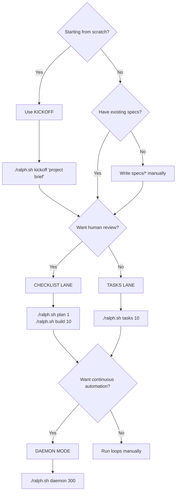

# Ralph Kit Docs

- `kickoff.md` — greenfield workflow to generate `docs/*` + `specs/*` using a memory-backed agent, then hand off to Ralph.
- `sandboxing.md` — how to run Ralph in full-auto safely (Docker fallback + cloud VM notes + pricing table).

GCP provisioning scripts live in `ops/gcp/`.

## Decision Tree

Use this to pick the right workflow for your situation:



## Shared Libraries

The kit includes shared bash libraries under `lib/`:

### lib/core.sh

Core utilities for logging, notifications, and git operations.

| Function | Description |
|----------|-------------|
| `ralph_core__log LEVEL MSG` | Timestamped logging. Levels: `info`, `warn`, `error` |
| `ralph_core__notify MSG` | Send Slack notification (requires `SLACK_WEBHOOK_URL` in `.env.local`) |
| `ralph_core__git_push_branch BRANCH` | Safe branch push with conflict detection and retry |
| `ralph_core__consume_flag FLAG` | Read and atomically clear a flag from `REQUESTS.md` |
| `ralph_core__hash_content FILE` | SHA256 hash for idempotency checks |
| `ralph_core__ensure_gitignore PATTERN` | Add pattern to `.gitignore` if not present |

### lib/llm.sh

Unified LLM execution with failover and rate-limiting.

| Function | Description |
|----------|-------------|
| `ralph_llm__run MODEL PROMPT [OPTS]` | Execute prompt via claude or codex CLI |
| `ralph_llm__with_failover PRIMARY FALLBACK PROMPT` | Try primary model, fall back on failure |
| `ralph_llm__structured MODEL PROMPT SCHEMA` | Get structured JSON output |

**Features:**
- Automatic model failover (e.g., claude → codex)
- Rate-limiting with exponential backoff
- Structured output support via JSON schemas
- Optional Codex security/review gates

**Example:**
```bash
source "$RALPH_DIR/lib/llm.sh"

# Simple execution
ralph_llm__run claude "Explain this error: $ERROR"

# With failover
ralph_llm__with_failover codex claude "Review this PR"

# Structured output
ralph_llm__structured claude "Analyze code quality" review.schema.json
```

Scripts in `bin/` source these libraries for consistent behavior across loops.

## Workflow Lanes

Ralph supports two workflow lanes:

### Checklist Lane (default)
Uses `IMPLEMENTATION_PLAN.md` as the task list with markdown checkboxes.

```bash
./ralph.sh plan 1    # Generate plan
./ralph.sh build 10  # Execute up to 10 iterations
```

**Best for:** Human-in-the-loop workflows where you want to review, edit, or reorder tasks.

### Tasks Lane (opt-in)
Uses `prd.json` for machine-readable task tracking with `passes: true/false` flags.

```bash
./ralph.sh tasks 10  # Execute prd.json tasks
```

**Best for:** Full automation where tasks are well-defined and don't need human review.

Progress is tracked in `progress.txt` with task completion status.

## Daemon Mode

The daemon (`ralph-daemon.sh`) runs loops automatically, monitoring for:
- Git changes (new commits, remote updates)
- `REQUESTS.md` modifications
- Control flags

**Control flags** (add to `REQUESTS.md`):
- `[PAUSE]` — Halt daemon until removed
- `[REPLAN]` — Trigger re-planning pass
- `[DEPLOY]` — Run `RALPH_DEPLOY_CMD` after successful build

**Blocker detection:** The daemon detects when the agent is stuck (e.g., unanswered questions) and pauses to prevent spam loops.

## Skills

Optional skills (installable via `--skills` flag) provide Claude/Codex/Amp agents with pre-built prompts:

- `ralph-prd` — generate Product Requirements Documents
- `ralph-tasks` — convert PRDs to machine-executable `prd.json` format

Install skills: `./install.sh /path/to/repo --wrapper --skills`

Skills are installed to `.claude/` in the target repo and auto-discovered by compatible agents.
