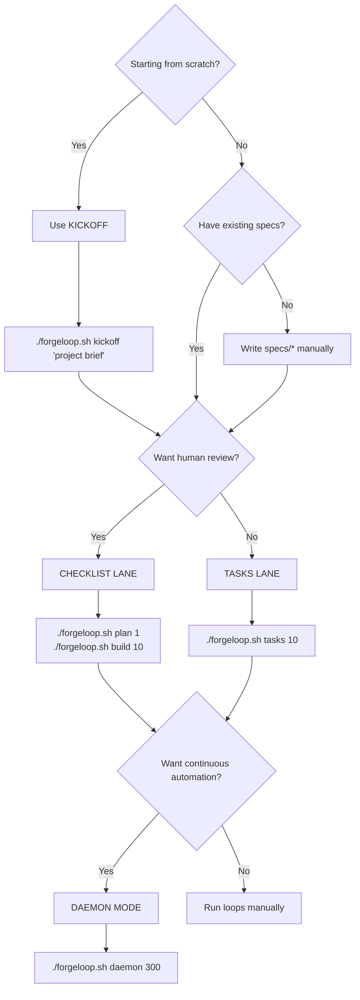

# Forgeloop Docs

- `kickoff.md` — greenfield workflow to generate `docs/*` + `specs/*` using a memory-backed agent, then hand off to Forgeloop.
- `sandboxing.md` — how to run Forgeloop in full-auto safely (Docker fallback + cloud VM notes + pricing table).

GCP provisioning scripts live in `ops/gcp/`.

## Skills-Driven Development (SDD)

Forgeloop is already a loop. **Skills-Driven Development** adds a pre-step: before you implement the next task, decide if the work would benefit from a reusable **Skill** (a small, focused SOP for an agent). If yes, forge the skill, sync it, then continue.

**Why:** fewer “prompt one-offs”, more repeatable delivery. Over time you build a repo-specific **skill factory** (including “middle-management” composed skills that coordinate other skills).

**Where skills live:**
- Project (recommended): `skills/<operational|meta|composed>/<skill-name>/SKILL.md`
- Kit (shipped): `forgeloop/skills/<operational|meta|composed>/<skill-name>/SKILL.md` (avoid editing unless you’re changing the kit itself)
`sync-skills` links kit + project skills into `.claude/skills` (Claude Code) and, when writable, `.codex/skills` (Codex).

**Repo hygiene:** commit `.claude/skills/` so the same skills are available for everyone. If you want Codex to discover repo skills without a user-level install, also commit `.codex/skills/`. Keep RepoPrompt-only skills prefixed `rp-` and ignore `.claude/skills/rp-*` (and `.codex/skills/rp-*` if you mirror Codex too).

**Naming:** keep skill folder names unique across all types (`operational/`, `meta/`, `composed/`). Mirrors use the leaf folder name, so duplicates will collide.

**Sync into agents:**
```bash
./forgeloop.sh sync-skills # refreshes repo-scoped skill mirrors (Codex mirror is best-effort if .codex is not writable)

# Optional: also install into user-level skill dirs (if present)
./forgeloop.sh sync-skills --claude-global --codex-global
# or: ./forgeloop.sh sync-skills --all
```
If you didn’t install the `forgeloop.sh` wrapper, run: `./forgeloop/bin/sync-skills.sh`.

## Decision Tree

Use this to pick the right workflow for your situation:



## Shared Libraries

The kit includes shared bash libraries under `lib/`:

### lib/core.sh

Core utilities for logging, notifications, and git operations.

| Function | Description |
|----------|-------------|
| `forgeloop_core__log LEVEL MSG` | Timestamped logging. Levels: `info`, `warn`, `error` |
| `forgeloop_core__notify MSG` | Send Slack notification (requires `SLACK_WEBHOOK_URL` in `.env.local`) |
| `forgeloop_core__git_push_branch BRANCH` | Safe branch push with conflict detection and retry |
| `forgeloop_core__consume_flag FLAG` | Read and atomically clear a flag from `REQUESTS.md` |
| `forgeloop_core__hash STRING` | SHA256 hash for idempotency checks |
| `forgeloop_core__hash_file FILE` | SHA256 file hash for idempotency checks |
| `forgeloop_core__ensure_gitignore PATTERN` | Add pattern to `.gitignore` if not present |

### lib/llm.sh

Unified LLM execution with failover and rate-limiting.

| Function | Description |
|----------|-------------|
| `forgeloop_llm__exec REPO_DIR PROMPT_SOURCE TASK_TYPE [STATE_FILE] [LOG_FILE]` | Execute a prompt with task-based routing |
| `forgeloop_llm__run_codex_review REPO_DIR SCHEMA [STATE_FILE] [LOG_FILE]` | Optional Codex review gate |
| `forgeloop_llm__security_gate REPO_DIR SCHEMA [STATE_FILE] [LOG_FILE]` | Optional security gate |

**Features:**
- Automatic model failover (e.g., claude → codex)
- Rate-limiting with exponential backoff
- Optional Codex security/review gates

**Example:**
```bash
source "$FORGELOOP_DIR/lib/llm.sh"

# Simple execution (stdin prompt)
printf "Explain this error: %s\n" "$ERROR" | forgeloop_llm__exec "$REPO_DIR" "stdin" build

# Optional security gate (schema-based)
forgeloop_llm__security_gate "$REPO_DIR" security.schema.json
```

Scripts in `bin/` source these libraries for consistent behavior across loops.

## Workflow Lanes

Forgeloop supports two workflow lanes:

### Checklist Lane (default)
Uses `IMPLEMENTATION_PLAN.md` as the task list with markdown checkboxes.

```bash
./forgeloop.sh plan 1    # Generate plan
./forgeloop.sh build 10  # Execute up to 10 iterations
```

**Best for:** Human-in-the-loop workflows where you want to review, edit, or reorder tasks.

### Tasks Lane (opt-in)
Uses `prd.json` for machine-readable task tracking with `passes: true/false` flags.

```bash
./forgeloop.sh tasks 10  # Execute prd.json tasks
```

**Best for:** Full automation where tasks are well-defined and don't need human review.

Progress is tracked in `progress.txt` with task completion status.

## Daemon Mode

The daemon (`forgeloop-daemon.sh`) runs loops automatically, monitoring for:
- Git changes (new commits, remote updates)
- `REQUESTS.md` modifications
- Control flags

**Control flags** (add to `REQUESTS.md`):
- `[PAUSE]` — Halt daemon until removed
- `[REPLAN]` — Trigger re-planning pass
- `[DEPLOY]` — Run `FORGELOOP_DEPLOY_CMD` after successful build
- `[INGEST_LOGS]` — Analyze logs into a new request (configure `FORGELOOP_INGEST_LOGS_CMD` or `FORGELOOP_INGEST_LOGS_FILE`)

**Blocker detection:** The daemon detects when the agent is stuck (e.g., unanswered questions) and pauses to prevent spam loops.

## Skills

Forgeloop includes a small Skills library (in `forgeloop/skills/`) you can use to standardize planning/execution workflows:

- `forgeloop-prd` — generate Product Requirements Documents
- `forgeloop-tasks` — convert PRDs to machine-executable `prd.json`
- `forgeloop-skillforge` — scaffold new reusable Skills
- `forgeloop-project-architect` — turn a brief into a concrete plan (incl. skill opportunities)
- `forgeloop-completion-director` — run an execution loop with locks/gates
- `forgeloop-builder-loop` — composed end-to-end build loop

Install into user-level agent skill dirs (when present): `./install.sh /path/to/repo --wrapper --skills`

For Claude Code per-repo discovery (no global install), run this in the target repo:
`./forgeloop/bin/sync-skills.sh` (creates/refreshes `.claude/skills` and, when writable, `.codex/skills` symlinks).
